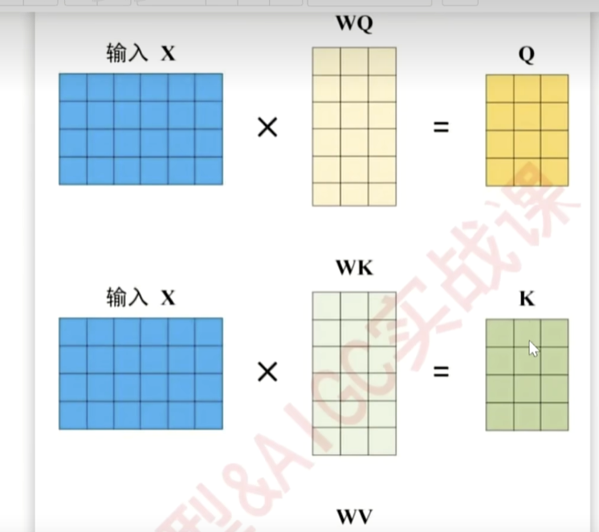
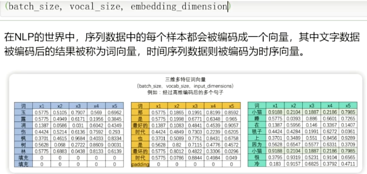
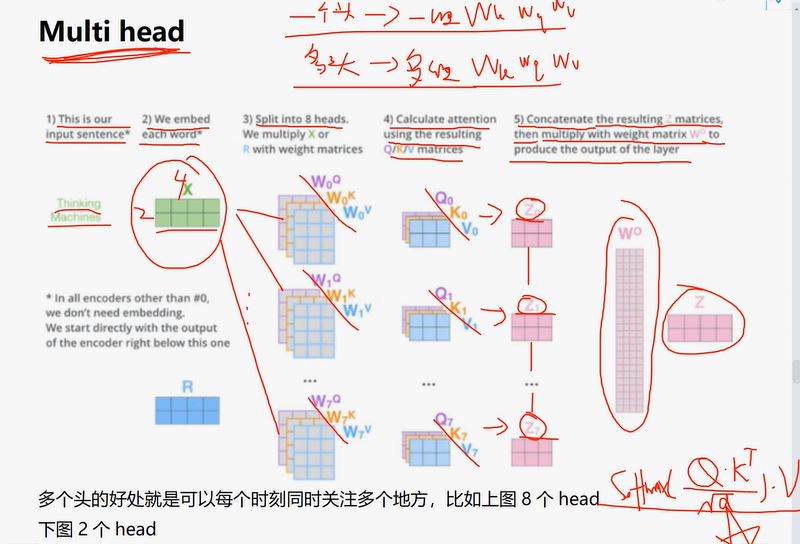
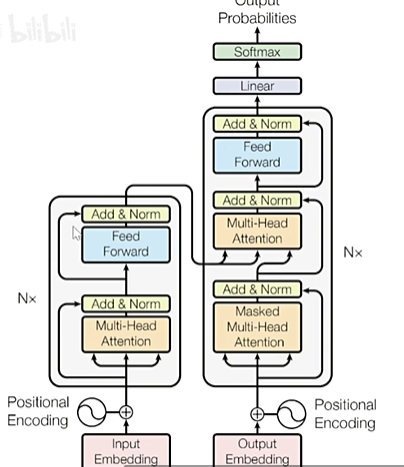
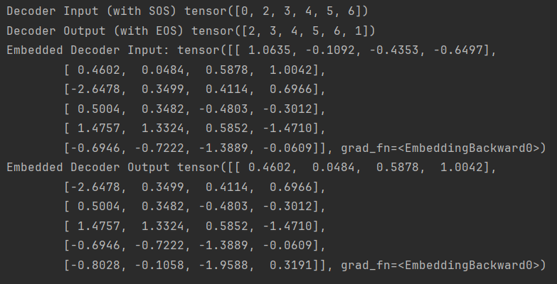
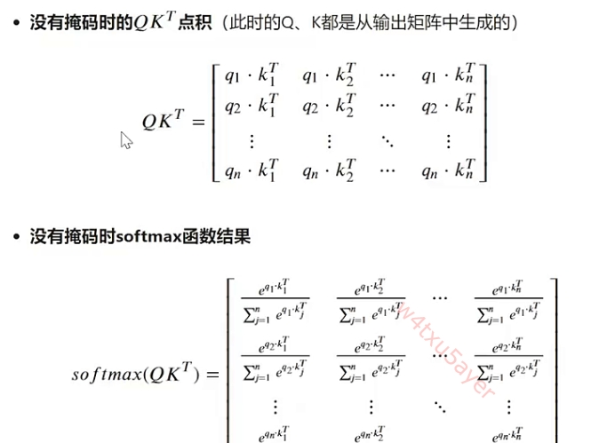
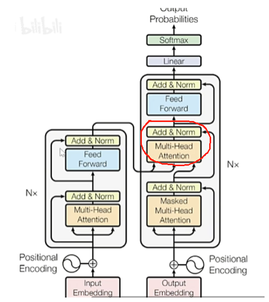
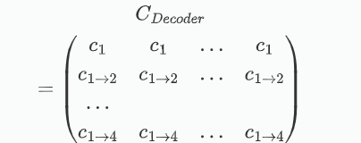
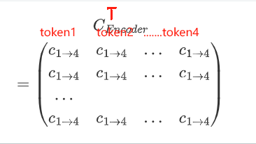
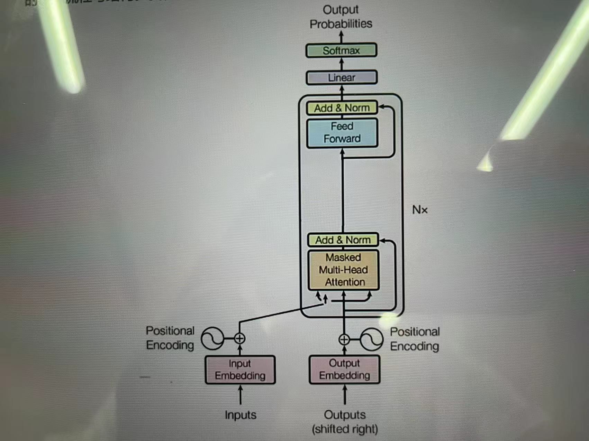

# 本文旨在简单理解Trasnformer的基本原理，可能存在某些小错误。如有发现请您Pull req


对于自注意力机制,它本质上是用加权求和的方式求解样本_样本之间的相关性,

ex:求解一个词在句子当中重要程度

## 1.1自注意力-self_Attention

假设给定了text_vector X

一般不会直接去做X@X_T,,, 而是给X,X_T都@一个w,得到w1X和w2X_T-->Q,K,Q用于询问,K用于应答

这两个w是神经网络训练得来的解读语义的参数矩阵,,不同迭代步数得到的w可能是不同的

因此得到的Q,K也是不同的  QK相乘后得到多组的相关性 



## 1.2 Transformer中的自注意力机制

Transformer中的相关性被称为注意力分数,公式如下

$Attention(Q, K, V)=softmax(\frac{Q K^{T}}{\sqrt{d_{k}}}) V$



公式中的$\sqrt{d_{k}}$表示特征的数量的开方,因为两个向量的相关程度应该与维度无关,但是计算的过程中,明显维度越大的,他们得出的点积越大,,为了消除维度的影响,应该除一个$\sqrt{d_{k}}$

softmax函数可以让单词之间的相关性转化为[0,1]之间的分布,以AB两个样本为例,我们会得到AA,AB,BA,BB四个相关性,经过softmax后,AA+AB=1,<br>

softmax归一化后的分数,就是注意力机制求解出的权重

V表示原始特征矩阵的语义解读

$QK=\begin{pmatrix}
  a_{11}&a_{12} \\
  a_{21}&a_{22}
\end{pmatrix}$    $ V=\begin{pmatrix}
  v_{11}&v_{12}&v_{13} \\
  v_{21}&v_{22}&v_{23}
\end{pmatrix}$​

从导出的公式可以看出,,得到的Attention是类似于"全连接"的,每个样本都询问了其他各个样本,这样的性质就决定了Transformer的性能要强于RNN和LSTM,但是代价也很明显,Transformer的复杂度是指数级的

$attention=QKV$  (2,2) × (2,3) -->(2,3)


## 1.3 multi-head Attention

对于每一个样本,$ W^Q, W^K,W^V$分别于Text_embedding相乘,得到KQV



这样做的目的是,对于同一句话,基于完全不同的解读和理解,去处理它,Transformer中head数量为8

这里的拼接其实非常简单粗暴

$Z_{1}=\begin{pmatrix}z_{11}&z_{12}&z_{13}\\z_{14}&z_{15}	&z_{16}\end{pmatrix}$
$Z_{2}=\begin{pmatrix}z_{21}&z_{22}&z_{23}\\z_{24}&z_{25}	&z_{26}\end{pmatrix}$

$Z_{cat}=\begin{pmatrix}z_{11}&z_{12}&z_{13}&z_{11}&z_{12}&z_{13}\\z_{14}&z_{15}&z_{16}&z_{24}&z_{25}&z_{26} \end{pmatrix}$

架构



其中Encoder层就是多头注意力机制,加和归一化,前馈神经网络和残差连接四大部分构成的,,,对于Decoder部分,最初的输入时Output_Embedding与Encoder是非常不同的

相对于Encoder,,,Decoder多出了一个带掩码的多头注意力机制,并且它吃的输入是NLP任务的标签,,,,它的输出作为Q,,Encoder的输出作为K和V,Encoder和Decoder都是六层  

第六层的Encoder会将输出传给  每一个 Decoder,,这样做是有道理的,一维Decoder的输入是标签,如果不这样设计必然会导致过拟合

## 2.Encoder


### 2.1Embedding_Layer

今天天气不错----->每一个文字转化为一个高维向量

每一个字都会获得一个唯一的编码

(1,512)

(1,512)

(1,512)

(1,512)

(1,512)

在Pytorch中,转化的过程是

(今天天气不错)----->(0,1,2,3,4,5)----->(1,512)

第二步是带权重的,是可训练的,这就意味着最终得到的vector(1,512)一定是和原来的prompt有关

### 2.2Positional Encoding

Transformer的计算,KQV中,相较于RNN和LSTM这种一个一个处理向量的方式,Transformer是一次处理很多的,因此它天然的丧失了每个词的位置信息

简单的位置编码可以描述为以下形式,,

`Embedding with Timesignal(1,512)=pos(1,512)+Embedding(1,512)`

当样本量(一段话中的词的数量)非常大的时候,,简单的加一个pos是非常不合理的,**因为位置的信息很可能掩盖掉Embedding的信息**,因此一定要避免这种情况的发生,因此就想到了用类似sigmoid之类的函数套在pos的外面,控制它的大小


Transformer选择了正余弦位置编码 

以 I love learning为例,

假设love是四个维度的, 将这四个维度标记为 [0,1,2,3] 偶数维度用sin,奇数维度用cos,,,,通过对不同的维度进行不同的三角函数编码,来构成一串独一无二的编码组合,   对于正余弦编码来说,编码数字本身是依赖于**样本的位置信息(索引)**,**所有维度的编号**,**总维度数**三个因子计算出来的


这里注意,,位置信息是行表示的,,比如 I love learning,---->(3,512),,位置信息是[0,1,2]

sin和cos处理的是奇数列和偶数列,,Q:位置信息是某一行,比如第3行表示第3个单词,但是sin,cos处理的是一行中的某些列,,这样怎么能提取到位置信息呢?

**sin(index,feature_index,input_dimension)**,这里一定注意,正余弦的参数不止某一列index表示文字的索引,是位置信息,  第二个表示第几列,,,第三个表示整体的维度,后两个作为辅助参数

### 2.3正余弦编码


​				<font size=5>$PE_{(pos,2i)}=sin(\frac{pos}{10000^\frac{2i}{d_{model}}})$</font>

​				<font size=5>$PE_{(pos,2i+1)}=cos(\frac{pos}{10000^\frac{2i}{d_{model}}})$​</font> 

pos 是位置信息,,,**i是特征编号**,,,**$d_{model}$是总的维度**(512)

使用正余弦编码的核心优势是,他们可以进行各种各样的变换,从而映射到不同维度的空间上(通过调节频率)   

frequency=0.5 

y=np.sin(frequency*x),,,,,这里<font size=5>$1000^\frac{2i}{d_{model}}$​</font> 就是频率,或称之为pos的缩放程度

`从形式上来看,,,i越大,sin越平缓,那么得到的正(余)弦小,,,i越小,震荡的越剧烈,也就是说,越靠前的文字信息的变化将会导致特征值的变化很明显,靠后的文字的变化对特征值的影响没有那么剧烈(sin变化得平缓)      特征编号小的特征构成剧烈变化的三角函数,特征编号大的特征构成轻微变化甚至完全单调的三角函数`

**从而,我们让小编号特征捕捉样本之间的布局差异,让大编号特征捕捉样本之间按顺序排列的全局趋势**


这样,针对不同位置的样本,,,就能得到不同的sin值

总而言之,,,<font size=5>$\frac{pos}{10000^\frac{2i}{{d_{model}}}}$​</font>想要得到的效果就是放大特征编号对于频率的影响,,从而影响三角函数,,,换句话说,,将不同的特征区分开来


小结 正余弦编码的意义

1.限制大小 scaling

2.调节频率得到更高位空间的映射

3.小编号特征捕捉样本件关系,大编号特征捕捉全局关系

此外,利用正余弦的周期性提高了模型泛化能力,,即便看到了一个从未见过的位置信息,也能通过周期性生成合理的编码


### 2.4残差网络

残差网络的思想:让中间的层向0拟合,残差连接不需要拟合,这种方式让只能堆积16层左右CNN的方式升级到能堆积150多层

添加残差层能保证网络不退化,,这个过程似乎是没有严谨的数学依据的


通过残差与输出结果连接后往往会进一个RELU层,,但是在Transformer里没有,Transformer里边是层归一化

残差的不断迭代可以面熟为以下的形式

$X_{i+1}=r(X_{i}+F(X_{i},W_{i}))$

其中F是网络中的某些层,,,$X_{i}$表示残差连接

不断迭代得到

$X_{I}=X_{i}+\sum_{n=i}^{I-1}F(X_{n},W_{n})$

此时对神经网络的结构求梯度,发现可以避免梯度消失的问题

导出的结果为
<font size=5>$\frac{\part Loss}{\part X_{i}}=\frac{\part Loss}{\part X_{i}}*(1+\frac{\part \sum_{n=i}^{I-1}F(X_{n},W_{n})}{\part X_{i}})$</font>


这里注意下,,Transformer在执行多头注意力机制的时候,以(100,60,512),4头注意力为例

之前讲过的方法是 512维度进4head中,最后拼接起来得到(100,60,1024),但是在实际操作中,会先将 512/4=128,,将(100,60,128)分别送到4heads中,,,,,处理完后拼接起来,这样残差连接也就只需要(100,60,512)  

按照朴素方法的话还需要将残差连接的原$X_{i}$复制4份	


### 2.5Normalization

1.归一化可以减少训练深度神经网络时内部协方差偏移,,内部协方差偏移-->Loss不稳定  2.梯度稳定,加快训练速度  3.减少初值依赖  4.允许更深的网络

batch_norm,,,,layer_norm

Sample(batch_size,vocal_size,input_dimensions)第三位是特征

   对于batch_norm,,跨批次对所有的样本的某一个(比如说第一个)特征进行归一化

   对于layer_norm,对于一个样本的所有特征进行归一化

​	比如I love learning  (3,5)  将每个单词的五个特征进行归一化

视觉领域常用batch_norm,,,Transformer用的是layer_norm


为什么选layer???  最简单的解释就是,,,句子往往是不一样长的,,,为了让他们相等,,通常会在短句的后边补0,,,但是这样做的话,算均值和方差的时候就会因为补的0而导致数据偏小,,发生错误


### 2.6前馈神经网络Feed_forward

Transformer中的Feed_Forward,,,从结构山来看,,,Feed_forward放在每一个block的最后一个地方,,给数据做非线性变换,,有一定的总结性作用

在Encoder中,Feed_Forward很可能是唯一的非线性结构

回顾之前,多头注意力机制是线性的加权求和


Feed_Forward中由三部分组成   线性函数-ReLU函数-线性函数

当一个架构的最后一层是线性层时,,,往往这个网络是可以单独使用的,也就是说Encoder只要在最后加一个输出用的激活函数,是可以单独作为一个网络来使用的,,		GPT是Decoder-only的架构,

### 2.7 不同网络的使用时机


类似**分类问题,,情感分类,,垃圾邮件,命名实体识别(人名地名),,,关系抽取(从病例中抽取药物和疾病之间的关系,,,小说中人物的关系)**,都可以用Encoder实现, 

还可以用Encoder将输入文本编码为一个予以表示,,,用这个表示里预测下一个呲或者生成文本序列,,,如生成对话


**什么时候使用整个的Transformer呢???**

Seq2Seq的任务中,,这里的Seq2Seq,,生成的序列要很大程度上依赖于给定序列的信息,,甚至要求两个序列几乎要等价 

 如**机器翻译,,,文本摘要,,,图像字母生成,,,,文本到语音,,问答系统**


**什么时候只用Decoder?**

预测型的

比如大预言模型,,给定文本序列,预测下一个出现的词或者句子,

**文本生成**,,,(给定一个只有开头的文本,,,补全内容) **代码补全** **对话生成**  **问答系统**	 


## 3.Decoder

在讨论Decoder之前,,有一个问题,,,输入和输出的Embedding形状很可能是不一样的(但是在input_dimension这个维度一定是一样的)

如果是机器翻译的任务,,它的输入输出的token很可能是不相同的  这样的话Encoder输出的KV和Decoder得到的Q很可能无法做矩阵的运算 **这里也需要注意一下,只有Q是带标签的,因为它来自于Decoder**

上述问题都会在Decoder中解决

### 3.1输入与Teacher_Forcing机制

#### 3.1.1输入

Decoder的输入是滞后一个单位的标签矩阵,,,滞后就是将当前序列向后移动一位,第一位变成NAN,,,Transformer中将NAN替换为**SOS**表示Start of sequence,,,与之对应的有**EOS** end of sequence,,,,,SOS是一定存在的,但是EOS不是必须的

- Tip:我们往往不会将真实的标签输入到网络当中去,如果这样做了,那么最终的结果可能是一个看起来很不错的Loss结果,,但是得到的是过拟合的,不好的模型

#### Encoder,Decoder所需要的输入

假设当前有要处理的序列和目标序列

- 输入序列x=
- 目标序列y=['it','is','the','best','time']

在Seq2Seq的任务中,由于Decoder需要输入标签,因此需要三种不同的数据

1.**Encoder的输入** **x**  不添加任何标记

2.**Decoder输入的标签** 在目标序列中添加 SOS

3.**Decoder用来算Loss的标签** 在目标序列中添加EOS

以上述x,y为例 

1.**Encoder的输入**  ['这','是','最','好','的','时','代']

2.**Decoder输入的标签** [**'SOS'**,it','is','the','best','time']

3.**Decoder用来算Loss的标签** ['it','is','the','best','time',**'EOS'**]

***一定注意,,,一个X,两个y!!!!***


```python
import torch
import torch.nn as nn
#词汇表的大小,包括SOS,EOS
vocab_size=10
embedding_dim=4
#创建嵌入层
embedding_layer=nn.Embedding(vocab_size,embedding_dim)
#假设索引0是SOS,1是EOS
SOS_token=0
EOS_token=1
#目标序列的索引表示
target_sequence=[2,3,4,5,6]#it was the best of 	times
#添加其实标记和结束标记
decoder_input=[SOS_token]+target_sequence##用来输入的
decoder_output=target_sequence+[EOS_token]##用来算Loss的
#转换为张量
decoder_input_tensor=torch.tensor(decoder_input)
decoder_output_tensor=torch.tensor(decoder_output)

#嵌入---之前提到过文字信息先变成[1,2,3,4..]然后再Embedding
embedded_decoder_input=embedding_layer(decoder_input_tensor)
embedded_decoder_output=embedding_layer(decoder_output_tensor)

print('Decoder Input (with SOS)',decoder_input_tensor)
print('Decoder Output (with EOS)',decoder_output_tensor)
print('Embedded Decoder Input:',embedded_decoder_input)
print('Embedded Decoder Output',embedded_decoder_output)

```




#### 3.1.2Teacher Forcing

把标签同样输入给模型

与Seq2Seq中同一序列中的预测不同,,,Transformer中的TF是用一张表预测另外一张表,它需要将特征矩阵和标签矩阵的信息融合后进行训练

**训练流程**

**第一步** 输入ebd_x&ebd_y[:1]>>>输出y_pred[1]

**第二步** 输入ebd_x&ebd_y[:2]>>>输出y_pred[2]

...

**第n步** 输入ebd_x&ebd_y[:n]>>>输出y_pred[n]

**注意,,每次输入的ebd_x都是整个矩阵,,,但是y是前 i 部分**,,,

也就是说,这个流程中实现了 **利用SeqA+SeqB的后半段---->预测B的后半段**,这样的方式就不会像模型泄露真实标签,  训练过程中,,流程**通过掩码自注意力机制+Encoder-Decoder_Attention合作完成**

注意,,这里为什么说**没有泄露任何标签信息**呢???

**因为Decoder_input的第一行是['SOS']**,,这样预测第 i 个词时,拿到的是前 i-1 个标签的信息

这样一来就保证了在不泄露真实标签的情况下为预测下一个词提供有效的信息,且避免了错误的累计,,上述的步骤之间是没有迭代性,或者说相关性的,,,第 i 步的计算没有依赖于第 i-1 步的计算,,,因此他们可以**并行进行!!!!!!**这相对于LSTM,RNN等是一个非常非常大的提升


以上描述的是**训练过程**,,,在**预测/推理过程中,是不存在真实标签的**,,此时,需要将上一步的embedding的输出作为下一步Decoder的输出,

**预测流程**

1.X_ebd&SOS---->y_pre[0]

2.X_ebd&y_pre[:0] ----->y_pre[1]

...

n. X_ebd&y_pre[:n-1]----->y_pre[n]

这是典型的**自回归 Auto-regressive**过程


**并行训练,,线性预测**


### 3.2Embedding与位置编码

与Encoder类似

### 3.3 掩码注意力与前瞻掩码

#### 3.3.1概述

Masked Self-Attehtion确保在生成当前时间步的输出时,模型不能查看未来的输入,这是通过注意力机制计算过程中通过掩码实现的,,,,**掩码**将未来未知的注意力得分设置为$-\infty$,这样经过Softmax后就为0,,

这样得到的效果可以理解为Q不能询问未来的K




有了掩码机制后,,,将M加到$softmax(QK^T)$中

$$M=\left[\begin{array}{ccccc}{0}&{-\infty}&{-\infty}&{\cdots}&{-\infty}\\{0}&{0}&{-\infty}&{\cdots}&{-\infty}\\{0}&{0}&{0}&{\cdots}&{-\infty}\\{\vdots}&{\vdots}&{\vdots}&{\ddots}&{\vdots}\\{0}&{0}&{0}&{\cdots}&{0}\end{array}\right]$$

这样得到的结果右上角就是负无穷,,,即  $q_{i}*k_{j}->-\infty$(i<j) ,  表示前边的样本无法访问靠后的样本,,这就是掩码机制的本质,,,,注意**这里的 k 是标签不是特征**

设得到的$QK^T$的结果为,,,,注意这里的角标是Seq_len这个维度,,表示第几个词向其他词提问,如第一行表示第一个词向第一个词提问,,第二行表示第二个词向第12个词提问,,第三个词表示它向第123个词提问
$$
Decoder-Masked-Attention=\begin{pmatrix}
a_{11}&0&0&0\\
a_{21}&a_{22}&0&0\\
a_{31}&a_{32}&a_{33}&0\\
a_{41}&a_{42}&a_{43}&a_{44}
\end{pmatrix}
$$


再经过Softmax层,就会得到注意力的分数


现在假设V矩阵如下,,这个V来自于真实标签,,,,**注意这里每个$v_{i}$ 是不同的**,,,不同的列对应着不同特征维度,,,,

**i表示time_step**,(或者vocal_size,Seq_len这个维度)
$$
V=\begin{pmatrix}
v1 &v1&v1&...&v1
\\v2&v2&v2&...&v2
\\v3&v3&v3&...&v3
\\v4&v4&v4&...&v4
\end{pmatrix}
$$


设上述两个矩阵得出的结果如下

​					$\begin{gathered}C=\text{Decoder-Masked-Attention}\times V\\C=\begin{bmatrix}a_{11}&0&0&0\\a_{21}&a_{22}&0&0\\a_{31}&a_{32}&a_{33}&0\\a_{41}&a_{42}&a_{43}&a_{44}\end{bmatrix}\begin{bmatrix}v_1&v_1&...&v_1\\v_2&v_2&...&v_2\\v_3&v_3&...&v_3\\v_4&v_4&...&v_4\end{bmatrix}\end{gathered}$

结果为

​							$c_{i}=\sum a_{ik}*v_{k}$​​ 
$$
C_{decoder}=
\begin{pmatrix}
a_{11}v_{1}& a_{11}v_{1}&...&a_{11}v_{1}\\
a_{21}v_{1}+a_{22}v_{2}&a_{21}v_{1}+a_{22}v_{2}&...&a_{21}v_{1}+a_{22}v_{2}\\
...\\
a_{41}v_{1}+a_{42}v_2+a_{43}v_{3}+a_{44}v_{4}&a_{41}v_{1}+a_{42}v_2+a_{43}v_{3}+a_{44}v_{4}&...&a_{41}v_{1}+a_{42}v_2+a_{43}v_{3}+a_{44}v_{4}
\end{pmatrix}
$$


其中,i>k的a_{ik}是为0的,因此上述结果仍然有后半部分无法询问前半部分的特性,

从结果来看,,

第一行表示ebd_y[,:0]的信息,,,第二行表示ebd_y[:1]的信息,,第三行表示ebd_y[:2]的信息.....

**有Auto-Regressive的特性**


上述的掩码机制其实就可以称为**前瞻掩码(上三角掩码)**,,达到的效果就是避免访问未来信息,,,他们都是Decoder专属的

#### 3.3.2掩码对于掩盖噪声的重要作用

在Seq2Seq任务中,,,Seq_len的大小往往是不同的,,为了让他们保持相同,,,需要将短缺的部分padding掉,,但是在后续的处理过程中,,,这段部分相当于噪声,掩码的另一个作用就是将这部分噪声掩盖掉,,,**填充掩码是Encoder和Decoder都能使用的,,,并且有很多参数都和掩码有关**,,,

其实出现在Encoder中的掩码就是Padding掩码

pytorch中,允许自创掩码矩阵M,输入到Pytorch的各个层进行掩码  --> $QK^T+M$

```python
import torch
#(4,10,8)
batch_size=4
seq_len=10
ebedding_dim=8

seq=torch.randint(0,5,(batch_size,seq_len,embedding_dim))
pad_token=0#要填充的掩码
seq[0,7:,:]=bad_token
seq[1,9:,:]=bad_token
seq[2,9:,:]=bad_token
seq[3,5:,:]=pad_token

#现在对于每个seq[i]都是一张表,,每张表都是10行8列

(seq==pad_token).all(dim=-1) #如果判断为True则说明这一行是填充的,,,dim=-1表示特征这个维度
#输出为

'''
这里的每一行理解为一个batch,,每一列是一个token
		token1 token2 token3 .... token10
batch1     0    0       0           1
batch2
batch3			...
batch4

[
	[False,False,False,False,False,False,False,True,True,True],
	[False,False,False,False,False,False,False,False,False,True],
	[False,False,False,False,False,False,False,False,False,False],
	[False,False,False,False,False,False,True,True,True,True],
]
这就表示第一张表的最后三列,第二章表的最后一列...全部是填充的
'''

(seq==pad_token).all(dim=-1).float()#将True标记为1
#对应的输出就是上述的内容,False->0,True->1
'''
[
	[0.,0.,0.,0.,0.,0.,0.,1.,1.,1.],
	[0.,0.,0.,0.,0.,0.,0.,0.,0.,1.],
	[0.,0.,0.,0.,0.,0.,0.,0.,0.,0.],
	[0.,0.,0.,0.,0.,0.,1.,1.,1.,1.],
]
'''

'''
现在Q(4,8,10)  KT(4,10,8)
则QKT_multi-head->(4,head,10,10),,假设Transformer中的头数为1
即多头注意力输出矩阵的形状为(4,1,10,10)

为了让Padding矩阵M能够和上述矩阵相加,,,M需要拓展和升维度
'''


import torch

# 创建一个形状为 (1, 6) 的张量
#1.重组,,总数量不变
s = torch.tensor([[0, 1, 2, 3, 4, 5]])
reshaped_s = s.reshape(-1, 3)#重塑每行有三列的张量,,,-1表示维度不确定,,,,这是重组的过程
'''
tensor([[0,1,2],
		[3,4,5]
		])
'''

#2.升维,拓展过程,,,中间其实是复制的过程,,数量变多了
s.unsqueeze(1).expand(-1,3,1)#unsqueeze(1)就表示在s外侧又加了一个方括号,只改变维度,不做其他的,unsqueeze后,变为(1,1,6)
#.enpand(-1,3,1) 表示第二个维度是3,剩下两个维度依然是原本的维度--->(1,3,6)
'''
tensor([[[0,1,2,3,4,5],
		[0,1,2,3,4,5],
		[0,1,2,3,4,5],
		]])

'''

'''
对于需要掩码的矩阵
[
	[0.,0.,0.,0.,0.,0.,0.,1.,1.,1.],
	[0.,0.,0.,0.,0.,0.,0.,0.,0.,1.],
	[0.,0.,0.,0.,0.,0.,0.,0.,0.,0.],
	[0.,0.,0.,0.,0.,0.,1.,1.,1.,1.],
]
这里的1表示这一行需要Padding,,以第一行为例,,这三个1需要拓展为三行1

'''
#对于掩码M   torch.Size(4,1,10,10)#batch_size,head,10行,10列
tensor([[[
    #以需要拓展的第一行为例,前7列为0,后3列为1
    [0,0,0,0,0,0,1,1,1],
   	[0,0,0,0,0,0,1,1,1]
   	[0,0,0,0,0,0,1,1,1]
   	[0,0,0,0,0,0,1,1,1]
   	[0,0,0,0,0,0,1,1,1]
   	[0,0,0,0,0,0,1,1,1]
   	[0,0,0,0,0,0,1,1,1]
   	[0,0,0,0,0,0,1,1,1]
   	[0,0,0,0,0,0,1,1,1]
   	[0,0,0,0,0,0,1,1,1]]]
    ...

])

#可以看出这种掩码不是上三角的形式
```

完整的掩码操作如下,,其中2,3步有时候pytorch的自动完成的

```python 
def crate_padding_mask(seq,pad_token=0):
    #seq(batch_size,seq_len,embedding_dim)
    #1.检查填充位置
    padding_mask=(seq==pad_token).all(dim=-1)#(batch_size,seq_len)
    #2.增加维度一匹配注意力权重矩阵(QKT)的形状
    #(batch_size,head,seq_len,seq_len)
    padding_mask=padding_mask.unsqueeze(1).expand(-1,seq.size(1),-1).unsequeeze(1)
    #3.将填充部分设置为无限大,有效数据设为0(0表示不遮盖这部分)
    padding_mask=padding_mask.float()*1e-9
    
    
    return padding_mask
#无须升维的版本
def crate_padding_mask0(seq_len,start_seq=1):
    #seq(batch_size,seq_len,embedding_dim)
    #检查填充值位置
    padding_mask=(seq==pad.token).all(dim=-1)
    padding_mask=padding_mask.float()*1e-9
    return padding_mask


#前瞻掩码-上三角
def crate_look_ahead_mask(seq_len,start_seq=1)
	#triangle_up上三角   一般是方阵,所以是(seq_len,seq_len),,,,这里是对角线的起始位置
	mask=torch.triu(troch.ones((seq_len,seq_len)),diagonal=start_seq)
    #mask=mask.float()*(-1e9)
    return mask
```

上三角矩阵

```
tensor([[0., 1., 1., 1., 1., 1., 1., 1., 1., 1.],
        [0., 0., 1., 1., 1., 1., 1., 1., 1., 1.],
        [0., 0., 0., 1., 1., 1., 1., 1., 1., 1.],
        [0., 0., 0., 0., 1., 1., 1., 1., 1., 1.],
        [0., 0., 0., 0., 0., 1., 1., 1., 1., 1.],
        [0., 0., 0., 0., 0., 0., 1., 1., 1., 1.],
        [0., 0., 0., 0., 0., 0., 0., 1., 1., 1.],
        [0., 0., 0., 0., 0., 0., 0., 0., 1., 1.],
        [0., 0., 0., 0., 0., 0., 0., 0., 0., 1.],
        [0., 0., 0., 0., 0., 0., 0., 0., 0., 0.]])

```

截止目前,,可以看出前瞻掩码和Padding掩码有非常大的区别


### 3.4 Encoder-Decoder Attention



这个层K,V矩阵来自于Encoder,,,Q来自Decoder,,,计算的流程仍然是$output=softmax(\frac {QK^T}{\sqrt{d_{k}}})V$

注意这个层只存在于Encoder_Decoder层,,,Decoder_only是不存在这个层的

这一层**允许解码器的每个位置访问整个解码器的输出**,,,这与掩码注意力层有着很大的不同,,

tip:还记得掩码是做什么用的吗?掩码就是防止访问未来信息的

这么做的目的是将上下文整合到输出序列的生成中,这种设计保证了Decoder能够给予完整的输入序列信息来生成每个输出元素

Decoder中Multihead_Attention的输出如下,,每一行只携带特定时间段信息的结果

简单分析一下这个矩阵表示什么含义:$v_{i}$表示第几个token,,每一列$v$表示不同维度的特征,$a_{ij}$表示带有掩码机制的$QK^T$,即后边token只能询问前边的,,,,**可以理解为这个矩阵的前 i 行恰好只携带了前 i 行的信息**
$$
C_{decoder}=\\
\begin{pmatrix}
a_{11}v_{1}& a_{11}v_{1}&...&a_{11}v_{1}\\
a_{21}v_{1}+a_{22}v_{2}&a_{21}v_{1}+a_{22}v_{2}&...&a_{21}v_{1}+a_{22}v_{2}\\
...\\
a_{41}v_{1}+a_{42}v_2+a_{43}v_{3}+a_{44}v_{4}&a_{41}v_{1}+a_{42}v_2+a_{43}v_{3}+a_{44}v_{4}&...&a_{41}v_{1}+a_{42}v_2+a_{43}v_{3}+a_{44}v_{4}
\end{pmatrix}
$$
现在将这个公式简化为下边的形式,,,注意这里的角标是time_step(seq_len)维度的,表示带有哪几个token的信息,,每一个不同的列的值是不同的,表示不同的特征维度
$$
C_{Decoder}\\=
\begin{pmatrix}
c_{1}&c_{1}&...&c_{1}\\
c_{1\rightarrow2}&c_{1\rightarrow2}&...&c_{1\rightarrow2}\\
...\\
c_{1\rightarrow4}&c_{1\rightarrow4}&...&c_{1\rightarrow4}

\end{pmatrix}
$$
Encoder中的Multihead_Attention中,,由于没有掩码,所以注意力分数,,,V矩阵如下


$$
Encoder-Attention=\begin{pmatrix}
a_{11}&a_{12}&a_{13}&a_{14}\\
a_{21}&a_{22}&a_{23}&a_{24}\\
a_{31}&a_{32}&a_{33}&a_{34}\\
a_{41}&a_{42}&a_{43}&a_{44}
\end{pmatrix}
\\\\

V=\begin{pmatrix}
v1 &v1&v1&...&v1
\\v2&v2&v2&...&v2
\\v3&v3&v3&...&v3
\\v4&v4&v4&...&v4
\end{pmatrix}
$$
 得到的$C_{Encoder}$如下
$$
C_{decoder}=\\
\begin{pmatrix}
a_{11}v_{1}+a_{12}v_{2}+a_{13}v_{3}+a_{14}v_{4}& a_{11}v_{1}+a_{12}v_{2}+a_{13}v_{3}+a_{14}v_{4}&...&a_{11}v_{1}+a_{12}v_{2}+a_{13}v_{3}+a_{14}v_{4}\\
a_{21}v_{1}+a_{22}v_{2}+a_{23}v_{3}+a_{24}v_{4}&aa_{21}v_{1}+a_{22}v_{2}+a_{23}v_{3}+a_{24}v_{4}&...&a_{21}v_{1}+a_{22}v_{2}+a_{23}v_{3}+a_{24}v_{4}\\
...\\
a_{41}v_{1}+a_{42}v_2+a_{43}v_{3}+a_{44}v_{4}&a_{41}v_{1}+a_{42}v_2+a_{43}v_{3}+a_{44}v_{4}&...&a_{41}v_{1}+a_{42}v_2+a_{43}v_{3}+a_{44}v_{4}
\end{pmatrix}
$$
简化为,,,可以看出,,,这里每一行携带的信息都是所有的token

这里每个$C_{1\rightarrow4}$是不同的,,对于每一行,,,他们在Encoder中发问不同,,第一行表示第一个token向其他发问,,第二行表示第二个token向其他发问,,,,,,对于每一列,,表示不同的维度
$$
C_{Encoder}\\=
\begin{pmatrix}
c_{1\rightarrow4}&c_{1\rightarrow4}&...&c_{1\rightarrow4}\\
c_{1\rightarrow4}&c_{1\rightarrow4}&...&c_{1\rightarrow4}\\
...\\
c_{1\rightarrow4}&c_{1\rightarrow4}&...&c_{1\rightarrow4}

\end{pmatrix}
$$
此时,,,$C_{Encoder}$携带的是特征矩阵X的信息,$C_{Encoder}$的每个元素都携带了全部token的信息,,,$C_{Decoder}$携带的是真实标签的信息,$C_{Encoder}$中的元素中,每一行代表前i个token的信息,,,**接下来将$C_{Encoder}$作为K,V,,将$C_{Decoder}$​作为Q,用每行的Q与全部的KV相乘,,,执行一种较为特殊的注意力机制**


decoder(token,feature)  Encoder(token,feature)

 

decoder * Encoder 转置---->表示第一个decoder中一个带标签的token  乘 Encoder中,由第i个元素向其他元素发问得到的信息    这个矩阵相乘的过程就是**Teacher Forcing**,,,即用SeqA+SeqB的前半段的信息预测SeqB的后半段信息

到这里其实更能理解掩码到底在做什么,,,它造出来一个好的标签矩阵,,,用来和Encoder的特征矩阵交互


## 4.Decoder-Only中的Decoder

### 

有两部分输入,,,与Transformer是类似的,

**这个架构下的输入也带有标签,,也有滞后操作和Teacher_Forcing,,Masked,residual_link等都是存在的**

但是这里左侧的Input_Embedding可以是与右侧Output有关,,也可以无关,,也就是说,他可以是任意的信息,当然,**左侧这个Input也是可以不存在的**,它通常表示的是脱离要预测的信息之外的一些信息,,比如说,现在有输入(Decoder侧的输入)[床前明月光,xxxxxx],希望能够补全后半部分,,,,,,,,,此时得到的结果可能是不太好的,,很有可能是大白话而不是诗,,,,但是这是在左侧input中输入"唐诗三百首",,,最终得到的结果很可能是符合预期的

由于已经没有了Encoder,,,所以Encoder-Decoder_Attention就不存在了,

这种框架下,训练的大部分都是**完全Auto_Regressive的流程**,也就是说,数据流的下一步依赖于上一步

Decoder的任务大概可以描述为:

1.**利用序列的前半段预测后半段**,,每预测出一个字,,就将这个字加入到下一次输入的"前半段"中

2.**利用Teacher_Forcing和自回归机制**,在训练(Teacher_Forcing),和预测(Auto_Regressive)流程中使用标签辅助预测,,训练过程中,,因为有了Teacher_Forcing机制,,,错误不会累计,,,,但是测试过程中错误会累积(这是Autoregressive必然导致的现象)

Tip:**在生成式的任务中,,一般不区分"特征和标签"这两种不同的数据,,大多数生成式任务中,我们只关注一种数据,,就是要继续生成,继续补充的那一段序列**,,生成式任务带有"自监督的属性",训练和生成的数据来自同一段序列,标签在下一个时间步会成为特征数据(自监督学习),但是会明显地区分输入和输出,,输入就是前半段,输出就是后半段

在这个框架下,利用Masked,训练的过程也可以是并行的,,但是这样做有个问题,,,对于最基础的掩码方法,,得到的效果是,用第1个字预测第2个,,用第12个预测第3个,,用123个预测第4个,,,,,,,,希望达到的效果是,用第一段话直接去预测一个词,,为了解决这个问题**需要改造掩码得到的三角矩阵**

原矩阵为

```
tensor([[0., 1., 1., 1., 1., 1., 1., 1., 1., 1.],
        [0., 0., 1., 1., 1., 1., 1., 1., 1., 1.],
        [0., 0., 0., 1., 1., 1., 1., 1., 1., 1.],
        [0., 0., 0., 0., 1., 1., 1., 1., 1., 1.],
        [0., 0., 0., 0., 0., 1., 1., 1., 1., 1.],
        [0., 0., 0., 0., 0., 0., 1., 1., 1., 1.],
        [0., 0., 0., 0., 0., 0., 0., 1., 1., 1.],
        [0., 0., 0., 0., 0., 0., 0., 0., 1., 1.],
        [0., 0., 0., 0., 0., 0., 0., 0., 0., 1.],
        [0., 0., 0., 0., 0., 0., 0., 0., 0., 0.]])
```

改造为

```
tensor([[0., 0., 0., 0., 1., 1., 1., 1., 1., 1.],
        [0., 0., 0., 0., 0., 1., 1., 1., 1., 1.],
        [0., 0., 0., 0., 0., 0., 1., 1., 1., 1.],
        [0., 0., 0., 0., 0., 0., 0., 1., 1., 1.],
        [0., 0., 0., 0., 0., 0., 0., 0., 1., 1.],
        [0., 0., 0., 0., 0., 0., 0., 0., 0., 1.],
        [0., 0., 0., 0., 0., 0., 0., 0., 0., 0.],
        [0., 0., 0., 0., 0., 0., 0., 0., 0., 0.],
        [0., 0., 0., 0., 0., 0., 0., 0., 0., 0.],
        [0., 0., 0., 0., 0., 0., 0., 0., 0., 0.]])
        
```

掩码的部分缩小,,这样开始的序列就不是一个词,而可能是一个比较完整的句子,,**这种操作可能出现在预测阶段,,,在训练阶段很可能不会改变对角线**
